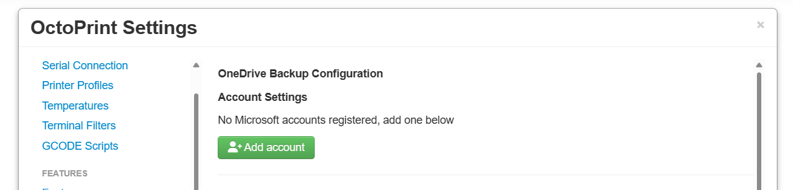
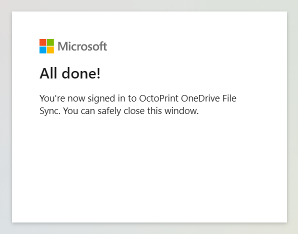
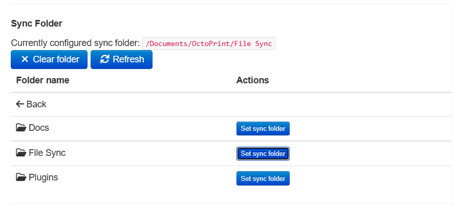
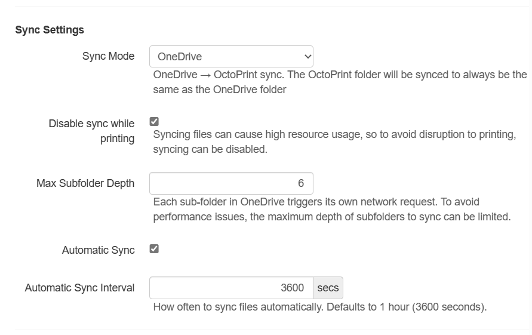

# OctoPrint OneDrive File Sync

Sync your OctoPrint files with OneDrive automatically.

## Installation

Install the plugin via the bundled Plugin Manager or manually using this URL:

```
https://github.com/cp2004/OctoPrint-OneDriveFileSync/releases/latest/download/release.zip
```

**Warning**: This plugin requires Python 3.7 or newer to install. To find out more about upgrading your OctoPrint install
to use Python 3, you can take a look at [this post](https://community.octoprint.org/t/upgrading-your-octoprint-install-to-python-3/35158)

**Warning 2**: Don't try installing this plugin from the source code on GitHub, since it has a separate build step for the
frontend code. If you are insterested in installing from source to contribute, please see the [contributing guidelines](CONTRIBUTING.md)

## Configuration

Once the plugin is installed and loaded, you can set it up to connect to your Microsoft account.

### Adding your account



Select 'Add account' to generate a login code. Head to the URL linked to login with your account, entering the code
generated and logging in with your Microsoft account. Grant OctoPrint OneDrive Backup access to your files.

Once this is done, return the plugin, and it should show your account name & a success message.



### Setting up a synced folder

You can use the built in file browser to find which folder in OneDrive you would like to sync with OctoPrint.
Files will be synced to an 'OneDrive' folder in your OctoPrint uploads.



### Syncing settings

Out of the box a sync will be run every hour, but you can set this interval much much lower if you would like.

The plugin does not upload whilst printing by default, to avoid issues with prints being interrupted should a file need
to be downloaded/uploaded and this takes away resources from printing.



## Contributing

Please see the [contributing guidelines](CONTRIBUTING.md) for more information.

## Sponsors

- [@KenLucke](https://github.com/KenLucke)
- [@CmdrCody51](https://github.com/CmdrCody51)

As well as 2 others supporting me regularly through [GitHub Sponsors](https://github.com/sponsors/cp2004)!

## Supporting my efforts


I created this project in my spare time, and do my best to support the community with issues and help using it. If you have found this useful or enjoyed using it then please consider [supporting it's development! ❤️](https://github.com/sponsors/cp2004). You can sponsor monthly or one time, for any amount you choose.

## Check out my other plugins

You can see all of my published OctoPrint plugins [on the OctoPrint Plugin Repository!](https://plugins.octoprint.org/by_author/#charlie-powell) Or, if you're feeling nosy and want to see what else I'm working on, check out my [GitHub profile](https://github.com/cp2004).
## ☁️
